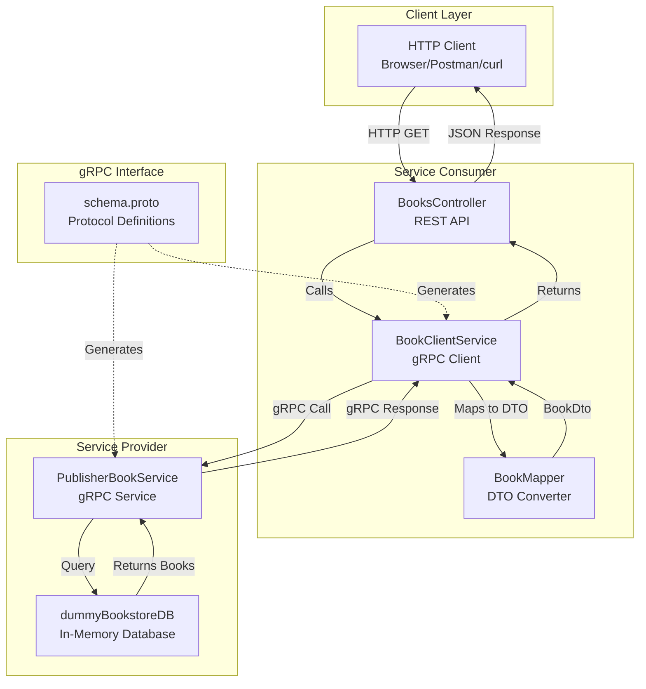
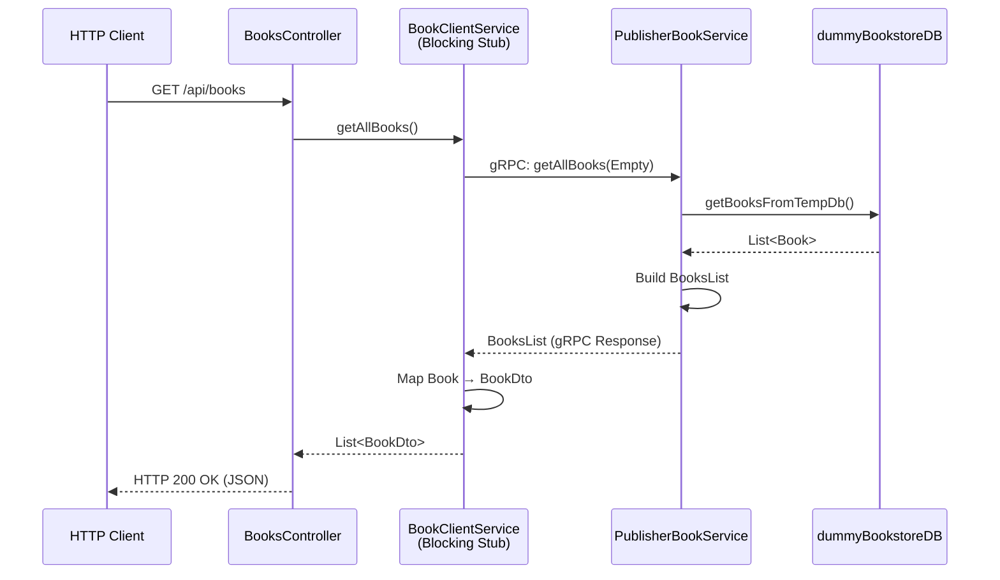
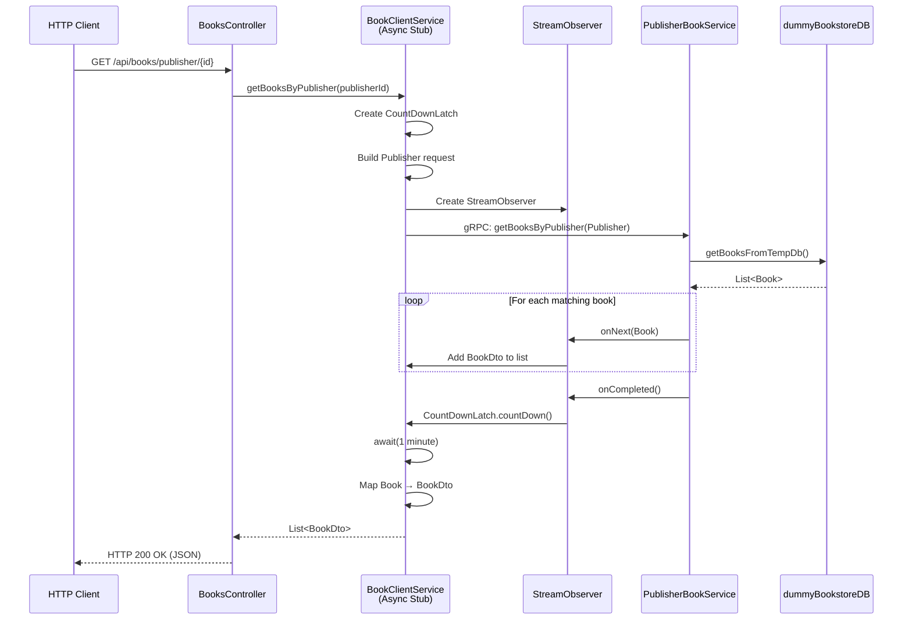
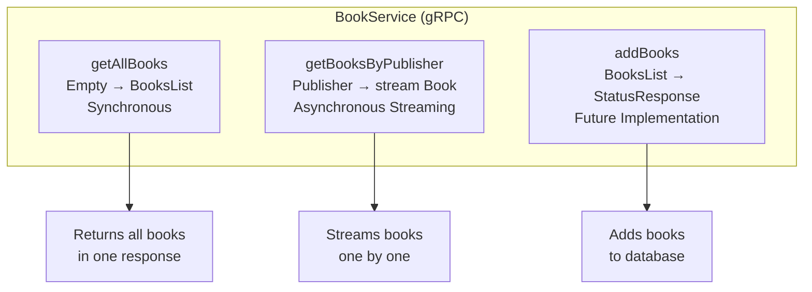
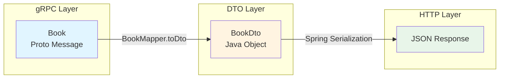
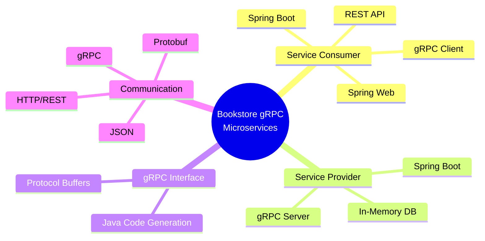

# Bookstore gRPC Microservices Architecture

## Architecture Overview



## Sequence Diagram - GetAllBooks (Synchronous)



## Sequence Diagram - GetBooksByPublisher (Asynchronous Streaming)



## Component Interaction Flow

```mermaid
flowchart LR
    subgraph "Request Flow"
        A[HTTP Request] --> B[BooksController]
        B --> C{Endpoint?}
        C -->|GET /api/books| D[getAllBooks<br/>Synchronous]
        C -->|GET /api/books/publisher/{id}| E[getBooksByPublisher<br/>Asynchronous]
    end
    
    subgraph "gRPC Communication"
        D --> F[Blocking Stub<br/>Request-Response]
        E --> G[Async Stub<br/>Streaming]
        F --> H[PublisherBookService]
        G --> H
    end
    
    subgraph "Data Layer"
        H --> I[dummyBookstoreDB]
        I --> J[In-Memory Books]
    end
    
    subgraph "Response Flow"
        J --> H
        H --> F
        H --> G
        F --> K[BookMapper]
        G --> K
        K --> L[BookDto]
        L --> M[HTTP Response]
    end
```

## gRPC Service Methods



## Data Transformation Flow



## Technology Stack



