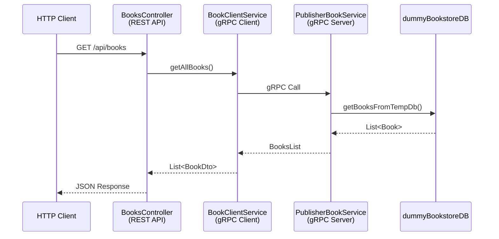

# Simple Data Flow Diagram

```mermaid
sequenceDiagram
    participant Client as HTTP Client
    participant Controller as BooksController<br/>(REST API)
    participant ClientService as BookClientService<br/>(gRPC Client)
    participant ServerService as PublisherBookService<br/>(gRPC Server)
    participant DB as dummyBookstoreDB
    
    Client->>Controller: GET /api/books
    Controller->>ClientService: getAllBooks()
    ClientService->>ServerService: gRPC Call
    ServerService->>DB: getBooksFromTempDb()
    DB-->>ServerService: List<Book>
    ServerService-->>ClientService: BooksList
    ClientService-->>Controller: List<BookDto>
    Controller-->>Client: JSON Response
```

