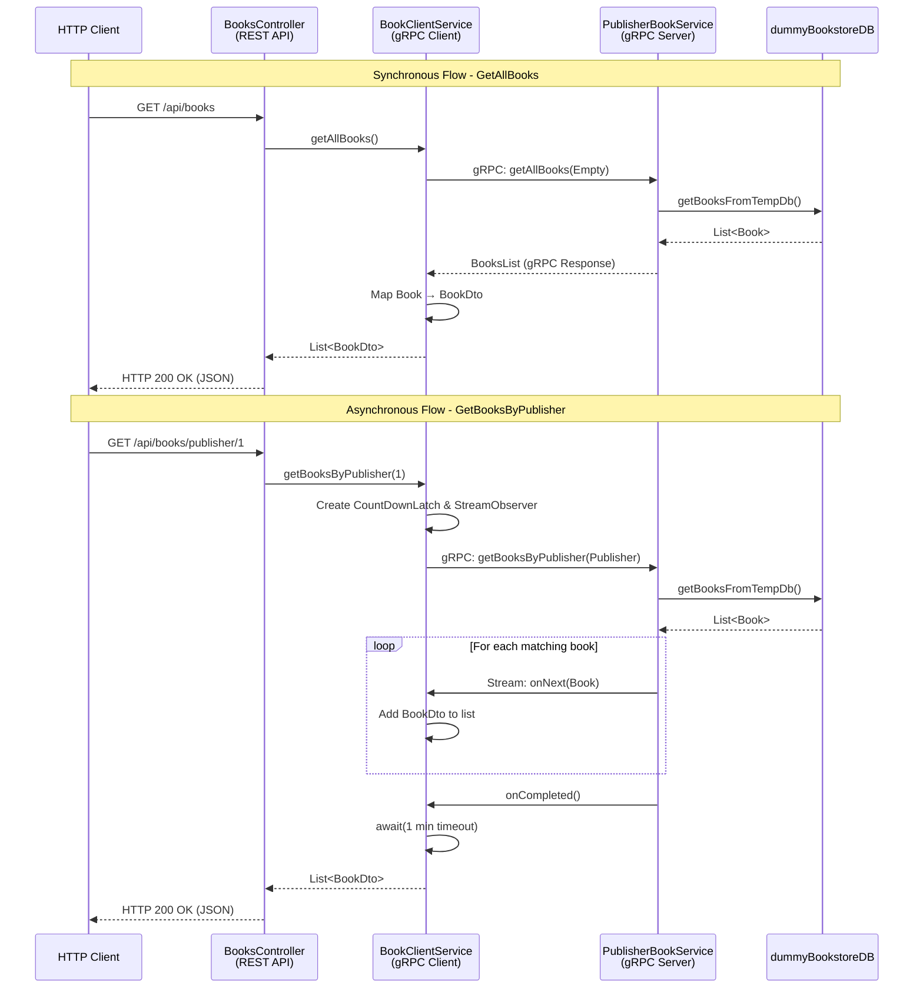
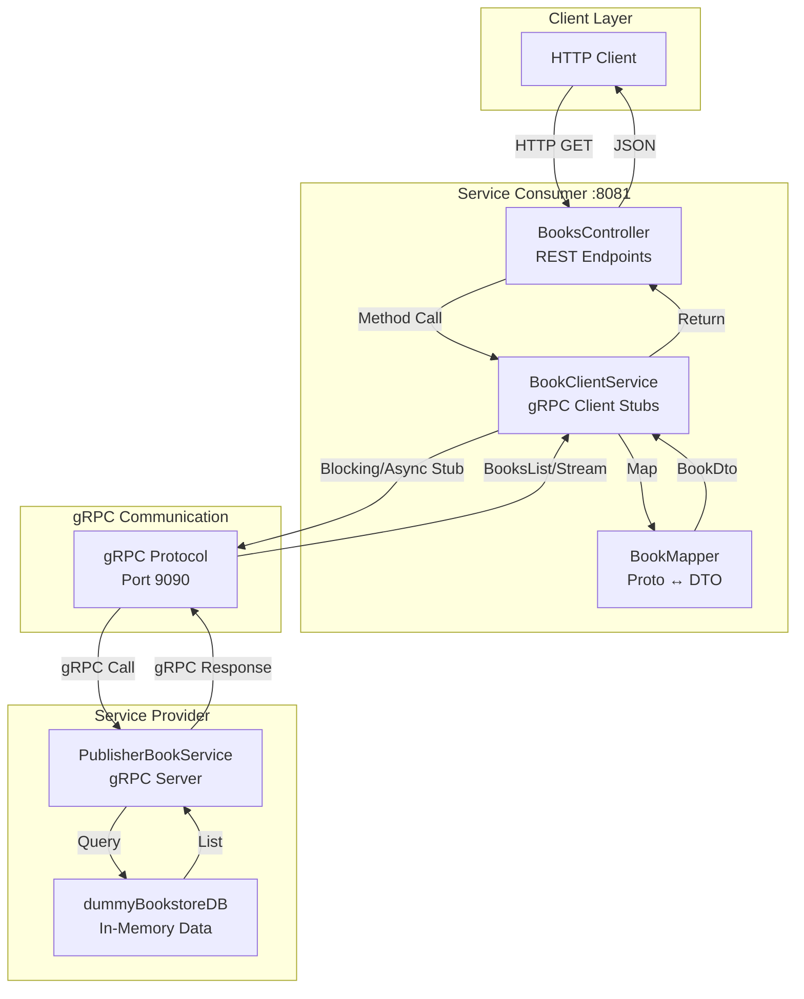
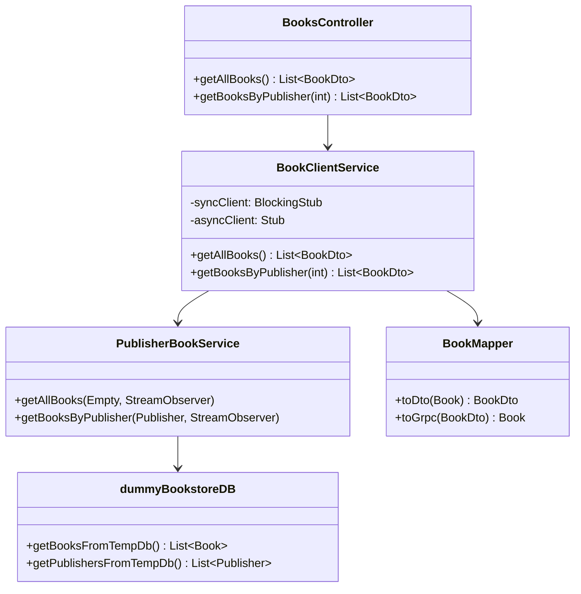

# Mermaid Diagrams for Bookstore gRPC Project

## 1. Complete Data Flow Diagram



## 2. Architecture Overview



## 3. Synchronous vs Asynchronous gRPC Calls

```mermaid
graph TB
    subgraph "Synchronous - getAllBooks"
        A1[HTTP Request] --> A2[BooksController]
        A2 --> A3[BookClientService.getAllBooks]
        A3 --> A4[Blocking Stub]
        A4 --> A5[gRPC: getAllBooks]
        A5 --> A6[PublisherBookService]
        A6 --> A7[Returns BooksList]
        A7 --> A8[Single Response]
        A8 --> A9[HTTP Response]
    end
    
    subgraph "Asynchronous - getBooksByPublisher"
        B1[HTTP Request] --> B2[BooksController]
        B2 --> B3[BookClientService.getBooksByPublisher]
        B3 --> B4[Async Stub + StreamObserver]
        B4 --> B5[gRPC: getBooksByPublisher]
        B5 --> B6[PublisherBookService]
        B6 --> B7[Streams Books]
        B7 --> B8[Multiple onNext calls]
        B8 --> B9[onCompleted]
        B9 --> B10[CountDownLatch.await]
        B10 --> B11[HTTP Response]
    end
```



## 4. Component Details



## 5. Request-Response Flow (Simplified)

```mermaid
flowchart TD
    Start([HTTP Request]) --> Endpoint{Which Endpoint?}
    
    Endpoint -->|/api/books| Sync[getAllBooks<br/>Synchronous]
    Endpoint -->|/api/books/publisher/{id}| Async[getBooksByPublisher<br/>Asynchronous]
    
    Sync --> SyncGrpc[gRPC Blocking Call]
    SyncGrpc --> SyncServer[Server: getAllBooks]
    SyncServer --> SyncDB[DB: Get All Books]
    SyncDB --> SyncResponse[Return BooksList]
    SyncResponse --> SyncMap[Map to BookDto]
    SyncMap --> SyncJSON[JSON Response]
    
    Async --> AsyncGrpc[gRPC Async Call]
    AsyncGrpc --> AsyncServer[Server: getBooksByPublisher]
    AsyncServer --> AsyncDB[DB: Filter by Publisher]
    AsyncDB --> AsyncStream[Stream Books]
    AsyncStream --> AsyncCollect[Collect in StreamObserver]
    AsyncCollect --> AsyncMap[Map to BookDto]
    AsyncMap --> AsyncJSON[JSON Response]
    
    SyncJSON --> End([HTTP 200 OK])
    AsyncJSON --> End
```

## 6. Data Model Flow

```mermaid
graph LR
    subgraph "Proto Layer"
        P1[Book.proto]
        P2[Publisher.proto]
        P3[BookGenre enum]
    end
    
    subgraph "Generated Java"
        J1[Book.java]
        J2[Publisher.java]
        J3[BookGenre.java]
    end
    
    subgraph "DTO Layer"
        D1[BookDto]
        D2[PublisherDto]
        D3[BookGenreDto]
    end
    
    subgraph "JSON Response"
        JSON[{"bookId": 1,<br/>"bookName": "...",<br/>"genre": "FICTION"}]
    end
    
    P1 --> J1
    P2 --> J2
    P3 --> J3
    J1 -->|BookMapper| D1
    J2 -->|PublisherMapper| D2
    J3 -->|BookMapper| D3
    D1 --> JSON
    D2 --> JSON
    D3 --> JSON
```

